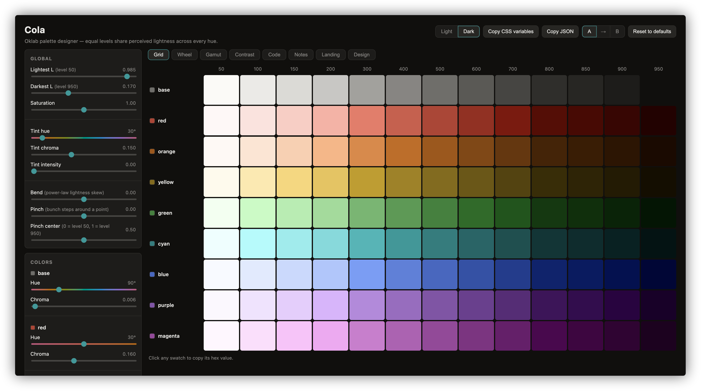

# Cola

> 🤖 This code was written by a human-led AI agent.



A web-based designer for UI-ready color palettes, modeled on
[Flexoki](https://stephango.com/flexoki): nine colors (base, red, orange,
yellow, green, cyan, blue, purple, magenta), each sampled at thirteen Oklab
lightness levels (50, 100, 150, 200, 300, 400, 500, 600, 700, 800, 850,
900, 950). All swatches are computed in Oklab so equal levels have equal
perceived luminosity regardless of hue. Out-of-gamut colors are pulled back
by reducing chroma at fixed lightness and hue.

## Run

```sh
go run .            # serves HTTPS on https://127.0.0.1:8443
go run . -addr :9000
go run . -http      # plain HTTP, for scripting
```

Settings persist to `state.json` (override with `-state`), debounced after
changes and flushed on shutdown. First run generates a self-signed certificate
for `localhost` in `certs/`. Trust it via your OS keychain, or use `-http`.

```sh
curl --cacert certs/localhost.crt https://127.0.0.1:8443/api/palette
```

## Controls

Global sliders:
- **Lightest/darkest L** — Oklab lightness for levels 50 and 950; intermediate
  levels are distributed between them with Flexoki-style spacing
- **Bend** — power-law skew of that distribution (positive pulls toward light)
- **Pinch** — bunch steps around a center point
- **Saturation** — global chroma multiplier
- **Tint hue/chroma/intensity** — mix a hidden tenth row into every color

Per-color OKLCH hue and chroma sliders (clamped to ±30° from ideal center
for chromatic colors; base is unconstrained).

Double-click any slider to reset it. Click swatches to copy hex. Header buttons
copy the full palette as CSS custom properties or JSON.

**A/B testing** compares two variants side-by-side; both slots persist across
restarts.

**View filters** (display-only): Grayscale, protanopia/deuteranopia/tritanopia
CVD simulations, blue light filter.

## Previews

- **Grid** — the swatch matrix
- **Wheel** — polar view by hue or fixed layout
- **Gamut** — interactive 3D OKLCH plot (angle=hue, radius=chroma, height=lightness)
- **Contrast** — WCAG AA report on realistic UI pairings
- **Code** — syntax-highlighted examples in graphical, terminal, and agent environments
- **Notes** — Obsidian-style note app with pairings display
- **Landing** — fictional brand page exercising all ramps
- **Design** — graphic design scenarios (posters, album art, patterns, type specimen)

All previews render live from the current palette and honor view filters.

## Light/dark toggle

Global scheme that complements all levels (50↔950, 200↔800, 500 fixed).
Each preview keeps its native face and is only complemented when the global
scheme differs. The app's own UI (dogfooding) is themed from the palette too.

## HTTP API

- `GET /api/palette` — current state and generated palette, plus defaults
- `POST /api/palette` — update state; optional `filters` array and `blueLight`
  intensity; returns palette and filtered copy
- `POST /api/reset` — restore default state; body may include `filters`,
  `blueLight`, `activeSlot`; other fields are ignored

A/B record (`ab`) is carried in every response and persisted in `state.json`.

Repository layout and development conventions in [AGENTS.md](AGENTS.md).
